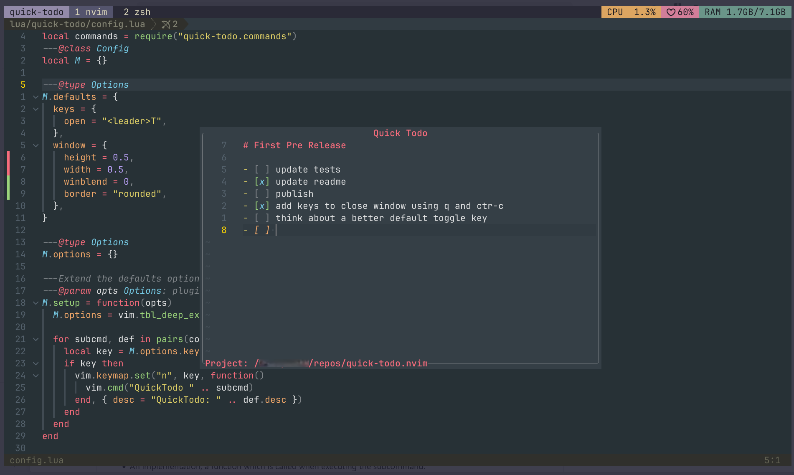

<h1 align="center">☑️ &nbsp;&nbsp;Quick Todo</h1>

Quick Todo lets you quickly jot down and track project-scoped todos;
with minimal disruption to your flow.

This plugin addresses a recurring annoyance in my workflow.
When I am in the middle of a change (especially in a flow state), writing down a
random idea or necessary todo can be annoying and often disruptive.

- I have tried creating a new item in Linear/Jira/Obsidian but that is a heavy
  context switch
- I have tried maintaining a local `tasks.md` in the repo but then I have
  to check it in, `.gitignore` it or do nothing and work around the file popping up everytime
  I do common git operations
- Prior to this, I would use a random notepad but that is not organized
  and is disconnected from the project

Quick Todo is simple, just press a key to toggle a project-scoped todo list in
markdown. Quickly jot down the task (and any notes), press the same key to close
and move on.



## Details

- The todo files are currently saved in the quick-todo plugin folder under
  `stdpath("data")`(run `echo stdpath("data")` to see what that maps to).
  Each todo file is saved in a sub folder based on the current working directory of
  each project.

## 🛠️ Setup

- **Neovim** (≥ 0.10)

### Installation

```lua
-- lazy.nvim
{
  "SyedAsimShah1/quick-todo.nvim",
  config = function()
    require("quick-todo").setup()
  end
}
```

### Configuration

```lua
-- Values below are the defaults
{
  "SyedAsimShah1/quick-todo.nvim",
  config = function()
    require("quick-todo").setup({
      keys = {
        open = "<leader>T",
      },
      window = {
        height = 0.5,
        width = 0.5,
        winblend = 0,
        border = "rounded",
      }
    })
  end
}
```

## Future Thoughts

The following are some features that I will likely add or am considering:

- Key to toggle todo state
- Integration with lualine to show the current todo (I'd first have to
  introduce the concept of a current todo)
- Config option to render the Todo window on the side instead of a floating one
- Some auto reordering of complete todos so the incomplete ones appear at the top
- Maybe pagenation to deal with long todo lists

## Similar Plugins

Below is a list of existing plugins that help manage todos. I looked at each of
them and thank the authors for the great work but the plugins didn't quite fit my
use case (there is also a bit of wanting to publish and use my first plugin).
Check them out and see if they are a better fit for you:

- [checkmate.nvim](https://github.com/bngarren/checkmate.nvim)
- [dooing.nvim](https://github.com/atiladefreitas/dooing)
- [doing.nvim](https://github.com/Hashino/doing.nvim)
